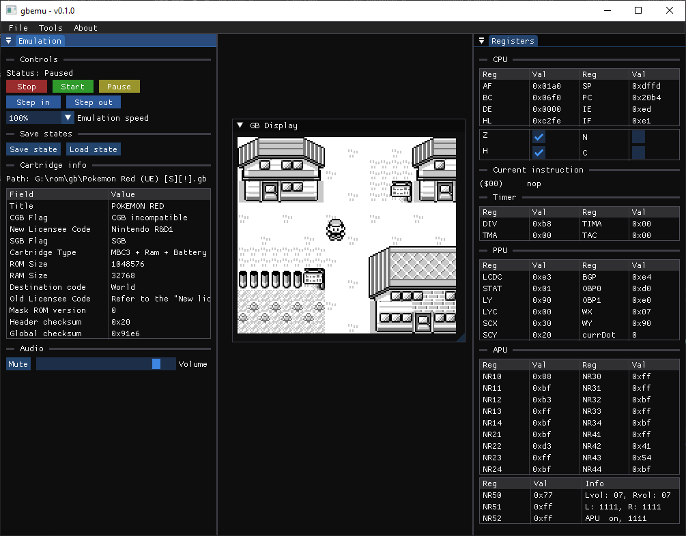
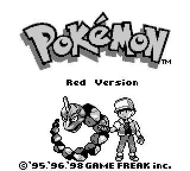
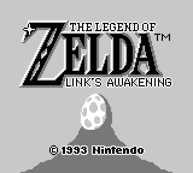
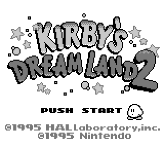
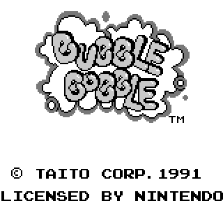
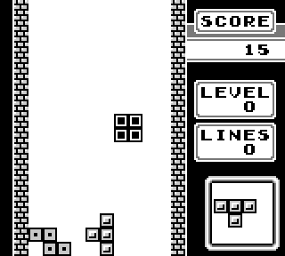
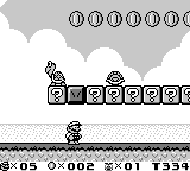

# `gbemu` - GameBoy Emulator

Repository for a multi-platform Gameboy emulator. This project aims at writing an emulator for the original Gameboy in C++ and maybe extend the support to Gameboy Color in the future. No-one pretends to be working on the most cycle accurate emulator here, this is just a hobby project and a way to learn how to write a working emulator for a (relatively) simple platform.

Dependencies (as submodules or included in the repo):

- DearImGui (for the GUI)
- ImPlot (for plotting audio signals)
- Tracy (for profiling)
- Miniaudio (to handle audio output)
- Doctest (for unit testing)
- Cereal (for serialization)
- STB (for image file utils)

External dependencies:

- GLFW 3
- Premake (to create VS2022 projects or makefiles)

Implemented features

- Basically fully playable, almost all subsystems are implemented, audio included. Not all Gameboy quirks are implemented though.
- Partial unit testing.
- Partial ROM testing (passes some Blargg's and Mooneye test roms).
- Some debug features are present:
    * Register display
    * Loaded cartridge info
    * Memory editor
    * Tile and OAM viewer
    * Background viewer
    * Audio visualization
    * Serial data log
    * Some basic support for step-by-step instruction execution and symbols loading

### TODOs:

Some things still have to be implemented or improved:

- Improve cycle accuracy
- Improve test ROMs results
- Gameboy Color support
- Add support for the `libretro` framework
- More unit testing
- Improve code coverage

## Build on Windows

Create a Visual Studio 2022 project for Windows:

```sh
$> premake5 vs2022
```

Open the visual studio solution and build the x64 release configuration of the `gbemu` project. On windows it's necessary to define the `GLFW_PATH` environment variable that points to the root of the GLFW folder.

To build and run tests you have to build the x64 release configuration of the `gbemu-tests` project.

## Build on Linux

Build and run the main emulator:

```sh
$> cd <repository path>
$> premake5 gmake

# Build and run the main emulator
$> make gbemu config=release -j8
$> ./build/bin/release/gbemu

# Build and run tests
$> make gbemu-test config=release -j8
$> ./build/bin/release/gbemu-tests
```

## Screenshots

The main UI on Windows while playing Pokemon Red:



Some game screenshot:

|  |  |
|---|---|
|  |  |
|  |  |
|  |  |
